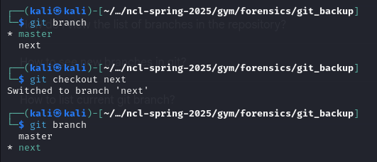

#### Version Control
* This room is based on Git
* Make it a habit to list hidden files in a directory (`ls -a`)
* Make sure you're in the same directory as the `.git` file
* `git --help` to see what commands can be run
* `git log` to see previous commits
* `git show <commit id>` to see the contents of that commit
* If you can't find information in the current branch, use `git branch` to list other branches and `git checkout <branch>` to switch to it

#### File Carving
* the `binwalk` command is your friend for this room
* `binwalk` searches for embedded files inside of binaries
* the `file` command will tell you what kind of file something is
* I like to use `binwalk -eM <file>` to recursively extract hidden files from the binary

#### PDF
* This room is a combination of the `pdf-parser` tool and also viewing it visually in your browser
* Just because there's black boxes over the text doesn't mean you can't copy it or remove them in a pdf editor

#### Magic Bytes
* #### will come back to this later

#### Docter
* Another `binwalk` challenge
* The same command from the [File Carving](#File%20Carving) room should work fine
* Understand the word document file structure