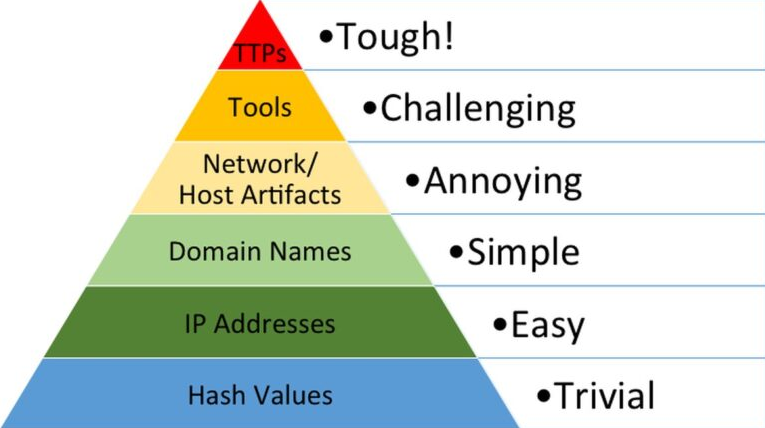

From attacker's point of view, how **painful** it would be evade detection and continue their attack

### Cyber Kill Chain
Recon
Weaponization
Delivery
Exploitation
Installation
Command and Control
Actions on Objectives

How do we stop these steps in the chain?

