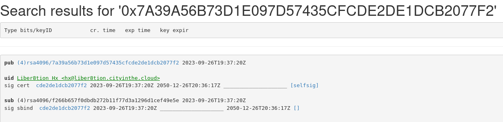
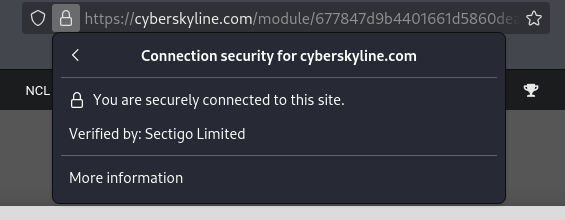
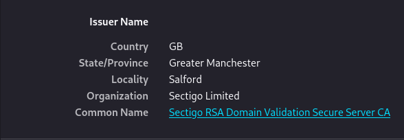
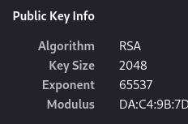

#### Meta (Metadata)
* Use a combination of **exiftool** and **exiv2**

#### Threat Intel (CVE Searching)
* https://www.cve.org/

#### WHOIS (Domain Registration)
* https://lookup.icann.org/en
* https://www.iana.org/domains/root/db (Top-Level Domains Information)

#### PGP Lookup
* PGP stands for "Pretty Good Privacy"
* Uses symmetric and public-key cryptography to secure emails and files
* https://keys.openpgp.org/
* https://keyserver.ubuntu.com/
* What email address is associated with the key fingerprint `7A39A56B73D1E097D57435CFCDE2DE1DCB2077F2`?

#### SSL (Secure Sockets Layer)
* SSL establishes an encrypted link between a web server and a browser
* TLS (Transport Layer Security) is more advanced and commonly used version
* You can download certificates from the browser

* Who is the issuer for Cyber Skyline's SSL certificate?

* How many bits long is the SSL key?

How many certificates are in the certificate chain?
* You can download the chain pem cert, read it normally (cat), and count the number of signatures you see

#### Barcode
* https://online-barcode-reader.inliteresearch.com/

[2\_Cryptography](2_Cryptography.md)