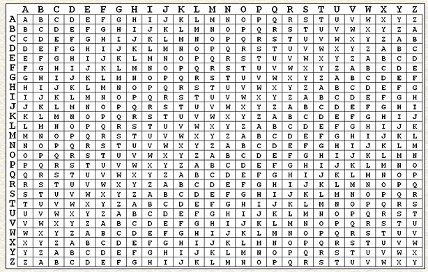

### https://gchq.github.io/CyberChef/
#### Number Bases
* CyberChef's "magic" feature should be able to solve most of these
	* base-2 (binary)
	- base-8 (octal)
	- base-16 (hexadecimal)
	- base-64 (base64)
* "0x" at the beginning of a string often means hex
* "=" at the end of a string usually indicates base64
	* base64 character set is a-z (26), A-Z (26), 0-9 (10), + / = (3) 
* 0s and 1s often means binary
* Text can be encoded multiple times

#### Shift
* Contains many types of ciphers, such as ROT-13 and Caesar
	* ROT-13 (Rotate 13) is a shift cipher with an offset of 13
	* Caesar is a shift cipher with an offset of 3
* Offset of 3 - 'A' becomes 'D', 'C' becomes 'F', etc.

#### @bash (atbash)
* atbash cipher
* Encodes string with the reverse of the alphabet
* 'A' becomes 'Z', 'B' becomes 'Y'

#### beep
* Morse code
* CyberChef also has this (of course)

#### Fencing
* Rail Fence Cipher (zigzag cipher)
* Create a grid of empty squares
* Insert each letter of your string in a zigzag pattern in the squares
* The encrypted string comes from reading the boxes from left to right, top to bottom
* In this case 'testcipher' becomes 'tceetihrsp'
* In order to decrypt, you need the ciphertext and a key
	* The key for a Rail Fence Cipher is the number of rows
	* For this case, the ciphertext is 'tceetihrsp' and the key is '3'

| t   |     |     |     | c   |     |     |     | e   |     |
| --- | --- | --- | --- | --- | --- | --- | --- | --- | --- |
|     | e   |     | t   |     | i   |     | h   |     | r   |
|     |     | s   |     |     |     | p   |     |     |     |

#### French
* Vigenère Cipher
* Uses a Vigenère Table

#### Strings
* Use the 'strings' command
* strings command looks for printable characters that are at least 4 characters long
* `strings Steg1.jpg | grep -i sky`
* This command will look for printable characters in Steg1.jpg, then look through those strings for the characters "sky"

#### RSA
* #### Will come back to this later

[3\_Password Cracking](3-Password-Cracking.md)